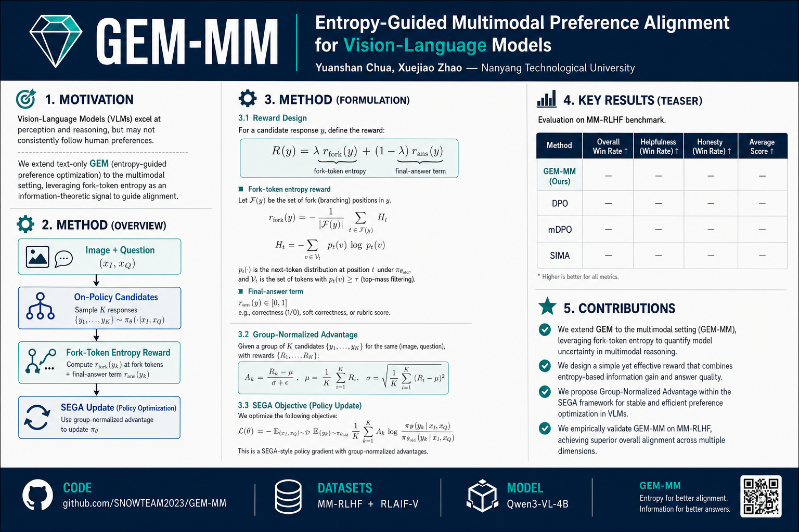

# GEM-MM

**Entropy-Guided Multimodal Preference Alignment for Vision-Language Models**

> Official code repository for **GEM-MM** — a multimodal extension of
> [GEM](https://arxiv.org/abs/2511.13007) that adapts entropy-guided on-policy
> SEGA training to vision-language models.

<p align="center">
  
</p>

<p align="center">
  <a href="https://github.com/SNOWTEAM2023/GEM-MM"></a>
  <a href="LICENSE"></a>
  <a href="CITATION.cff"></a>
  
  
</p>

---

## Highlights

- **GEM → vision:** fork-token entropy rewards + SEGA updates for VLMs  
- **Fair bake-off:** same 3000-sample MM-RLHF budget vs DPO / MM-DPO / mDPO / SIMA  
- **Full fine-tune** SEGA (gradient checkpointing); no LoRA in reported runs  
- **Public benches:** MMHal-Bench, HallusionBench, MME (+ POPE / AMBER / safety)  
- **Transfer:** RLAIF-V cross-dataset evidence  

## Method (one glance)

```text
image + question
      │
      ▼
 on-policy candidates (k)
      │
      ▼
 entropy at fork tokens  +  final-answer term   →  reward r
      │
      ▼
 group-normalized advantage  →  SEGA parameter update (full FT)
```

See [`docs/method.md`](docs/method.md) for equations and VLM-specific details.

## Repository layout

```text
GEM-MM/
├── assets/           # poster, figures
├── configs/          # YAML configs (main + ablations)
├── docs/             # method, datasets, reproduce, checklist
├── examples/         # quickstart
├── scripts/          # train / eval entrypoints
└── src/gem_mm/       # library code
```

## Installation

```bash
git clone https://github.com/SNOWTEAM2023/GEM-MM.git
cd GEM-MM
conda env create -f environment.yml
conda activate gem-mm
pip install -r requirements.txt
pip install -e .
```

Requires a CUDA GPU (≥24GB recommended for 4B full FT; 40GB comfortable).

## Quickstart

```bash
# 1) Point to your model + data roots
export GEM_DATA_ROOT=/path/to/data
export GEM_MM_OUT_ROOT=/path/to/outputs
export MODEL_NAME=Qwen/Qwen3-VL-4B-Instruct   # or a local snapshot

# 2) Train GEM-MM (SEGA) on a preference JSONL split
python scripts/train_gem_mm.py --config configs/default_gem_mm.yaml

# 3) Preference / choice eval on held-out pairs
python scripts/eval_preference.py --config configs/default_gem_mm.yaml \
  --checkpoint $GEM_MM_OUT_ROOT/gem_mm/checkpoint-final
```

More detail: [`examples/quickstart.md`](examples/quickstart.md) · [`docs/reproduce.md`](docs/reproduce.md)

## Datasets

| Dataset | Role |
|---------|------|
| [MM-RLHF](https://github.com/Kwai-Keye/MM-RLHF) | Main preference training / eval |
| [RLAIF-V](https://huggingface.co/datasets/openbmb/RLAIF-V-Dataset) | Cross-dataset transfer |

Preparation notes: [`docs/datasets.md`](docs/datasets.md)

## Results (preview)

Primary fair setting: **Qwen3-VL-4B-Instruct**, **3000** MM-RLHF train IDs, **1000** held-out eval.

| Method | Pref% | Notes |
|--------|------:|-------|
| Base | 51.2 | Instruct checkpoint |
| SFT | 57.9 | |
| DPO | 58.9 | |
| MM-DPO | 58.1 | |
| mDPO | 58.4 | |
| SIMA | *(pending)* | Self-critiquing pairs + DPO |
| **GEM-MM** | **61.7** | Full FT SEGA (`abl_gem_full`) |

Public-bench and ablation tables will be finalized with the paper draft.  
Poster: [`assets/poster.png`](assets/poster.png)

## Citation

If you use this code, please cite:

```bibtex
@misc{gemmm2026,
  title        = {GEM-MM: Entropy-Guided Multimodal Preference Alignment for Vision-Language Models},
  author       = {Chua, Yuanshan and Zhao, Xuejiao},
  year         = {2026},
  howpublished = {\url{https://github.com/SNOWTEAM2023/GEM-MM}},
  note         = {Code and resources}
}
```

Also consider citing the original text GEM work: [arXiv:2511.13007](https://arxiv.org/abs/2511.13007).

## Acknowledgments

Built on ideas from GEM, DPO, multimodal preference learning (MM-DPO, mDPO, SIMA), and the Qwen3-VL model family. Experiments use open benchmarks (MMHal, HallusionBench, MME, POPE, AMBER).

## License

MIT — see [`LICENSE`](LICENSE).

## Contact

- Yuanshan Chua — `YCHUA060@e.ntu.edu.sg`  
- Xuejiao Zhao — `xjzhao@ntu.edu.sg`  
- Org: [SNOWTEAM2023](https://github.com/SNOWTEAM2023)
