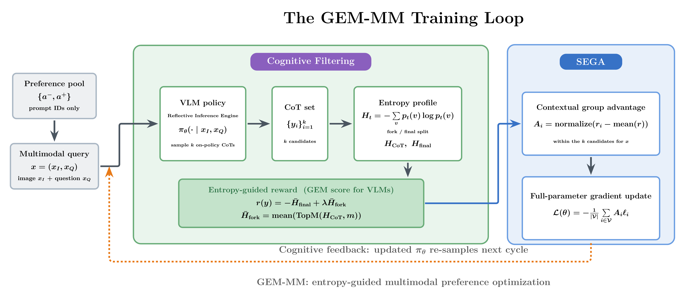

<h1 align="center">GEM-MM: Entropy-Guided Preference Alignment for Vision-Language Models</h1>

<p align="center">
  <a href="https://github.com/SNOWTEAM2023/GEM"></a>
  <a href="https://arxiv.org/abs/2511.13007"></a>
  <a href="LICENCE.txt"></a>
</p>

💻 This is the official implementation of **GEM-MM**: Entropy-Guided Preference Alignment for Vision-Language Models.

🧬 **GEM-MM** extends [**GEM**](https://github.com/SNOWTEAM2023/GEM) ([AAAI 2026 oral](https://aaai.org/conference/aaai/aaai-26/), [arXiv:2511.13007](https://arxiv.org/abs/2511.13007)) from text-only LLMs to **vision-language models**. Instead of consuming offline preference pairs with a sequence-level DPO-style loss, GEM-MM samples on-policy chain-of-thought candidates, scores them with a **fork / final entropy reward**, and updates the full VLM with **SEGA** (group-normalized policy gradients).

#### Authors
Yuanshan Chua, [Xuejiao Zhao*](https://zxjwudi.github.io/xuejiaozhao/)

**Nanyang Technological University &nbsp;|&nbsp; LILY Research Centre (NTU) &nbsp;|&nbsp; ANGEL Research Institute (NTU)**

\* Corresponding author

---

## 🔥 News
* **[2026.07]** Public code skeleton, demo data, and README released.
* Paper draft under preparation (MM-RLHF fair-budget bake-off).

---

## 🧭 Framework Overview

<p align="center">
  
</p>
<p align="center"><em>Figure 1: GEM closed-loop pipeline instantiated by GEM-MM for VLMs
(Cognitive Filtering + SEGA; multimodal query <code>x = (x_I, x_Q)</code>).</em></p>

**GEM-MM** aligns a VLM with a **Cognitive Feedback Loop**:

* **Cognitive Filtering**: sample `k` CoT candidates per multimodal prompt; score with entropy-guided token scoring that **rewards high entropy on fork tokens** (visual commitment points) and **penalizes high entropy on the final answer**.
* **SEGA**: listwise update with **group-normalized advantages**
  `A_i = (r_i − mean(r)) / (std(r) + ε)` inside each `k`-way group, then a full-parameter policy-gradient step.

### Key formulas

**Token entropy**

```math
H_t = -\sum_v p_t(v)\log p_t(v)
```

**Fork / final reward** (paper primary: `λ = 2.0`, `ρ = 0.05`)

```math
r(y) = -\bar{H}_{\mathrm{final}} + \lambda\,\bar{H}_{\mathrm{fork}}
```

**SEGA objective**

```math
A_i = \frac{r_i - \mathrm{mean}(r)}{\mathrm{std}(r)+\varepsilon},\qquad
\mathcal{L}(\theta)=\frac{1}{|\mathcal{V}|}\sum_i (-A_i\log\pi_\theta(y_i\mid x))
```

---

## 🚀 Quickstart

### 0) Install

```bash
git clone https://github.com/Y0306S/GEM-MM.git
cd GEM-MM
pip install -r requirements.txt
```

**Hardware.** CUDA GPU recommended. Paper runs use **Qwen3-VL-4B-Instruct**, full fine-tune, gradient checkpointing, on a **40 GB** A100-class GPU.

### 1) Data preparation

This project expects multimodal preference pairs as JSONL:

```jsonl
{"id": 1, "prompt": "...", "image": "rel/path.jpg", "chosen": "...", "rejected": "..."}
```

A tiny demo file is provided at `data/preference_data.jsonl`. Put images under `data/images/` (paths are relative to `--image_root`).

**Paper datasets** (not redistributed here; obtain from the original sources):

1. **[MM-RLHF](https://github.com/Kwai-Keye/MM-RLHF)** — primary corpus. We use the first **3000** unique short-prompt IDs for training and IDs **3001–4000** for held-out preference evaluation.
2. **[RLAIF-V](https://huggingface.co/datasets/openbmb/RLAIF-V-Dataset)** — transfer / negative-transfer study in the paper appendix.

You can also plug in custom multimodal pairs in the same `(prompt, image, chosen, rejected)` format.

### 2) Run GEM-MM

```bash
python GEM_MM.py \
  --data_path data/preference_data.jsonl \
  --image_root data/images \
  --model_name Qwen/Qwen3-VL-4B-Instruct \
  --output_dir output/gem_mm_final
```

Optional flags: `--skip_sft`, `--skip_sega`.

> The public trainers ship as a **GEM-style skeleton** (same module layout as [SNOWTEAM2023/GEM](https://github.com/SNOWTEAM2023/GEM)). Wire the Qwen-VL chat template + generate/score hooks in `src/sft_trainer.py` and `src/gem_trainer.py` for full reproduction; scoring math lives in `src/entropy_scorer.py`.

---

## ✨ Code Structure

```text
GEM-MM/
├── GEM_MM.py                 # Main entry (SFT → SEGA), mirrors GEM.py
├── data/                     # Demo preference JSONL + images/
│   └── preference_data.jsonl
├── src/                      # Core implementation
│   ├── __init__.py
│   ├── config.py             # Hyperparameters (λ, ρ, k, …)
│   ├── dataset.py            # Multimodal preference dataset
│   ├── entropy_scorer.py     # Fork / final entropy reward
│   ├── gem_trainer.py        # SEGA training loop
│   ├── sft_trainer.py        # Supervised warm-start
│   └── model_utils.py        # Qwen2/3-VL loaders
├── materials/                # Pipeline figure
│   └── gem_pipeline_tikz_2.png
├── README.md
├── LICENCE.txt
└── requirements.txt
```

### Implementation notes

* **Entropy-guided scoring** implements the final-answer entropy penalty and top-`ρ` fork entropy average (`src/entropy_scorer.py`).
* **SEGA** uses within-group standardization of rewards before the policy update.
* Preference pairs define the **prompt pool** and held-out eval; GEM-MM does **not** use `chosen`/`rejected` as DPO targets during SEGA.
* Paper runs are **full fine-tunes** (no LoRA).

### Reproducibility knobs (`src/config.py`)

| Knob | Meaning | Paper primary |
|------|---------|---------------|
| `k_candidates` | CoTs per prompt | 3 |
| `lambda_weight` (λ) | Fork entropy weight | 2.0 |
| `top_m_ratio` (ρ) | Top-entropy fraction on CoT | 0.05 |
| `temperature` | Sampling temperature | 0.9 |
| `sega_lr` | SEGA learning rate | 1e-5 |
| `min_pixels` / `max_pixels` | Vision token budget | 200704 / 401408 |

A conservative operating point (`λ=2.5`, `τ=0.8`) raises near-chosen rate to **62.4%** while trading off depth / hallucination (see paper).

---

## 📊 Experimental Results

**Protocol.** Backbone **Qwen3-VL-4B-Instruct** · **3000** MM-RLHF train IDs · **1000** held-out pairs · same chat template / token budget for all systems · **full fine-tune**.

Baselines: SFT, MM-DPO, mDPO, SIMA (heuristic self-improvement family).

| Method | Depth Pref % | Implicit rew. % | A/B % | AMBER Hal ↓ | CHAIR ↓ |
|--------|:------------:|:---------------:|:-----:|:-----------:|:-------:|
| SFT | 57.9 | 40.9 | 66.4 | 24.0 | 5.1 |
| MM-DPO | 58.1 | 41.0 | 66.4 | 23.4 | 5.0 |
| mDPO | 58.4 | 40.2 | 66.1 | 23.4 | 5.0 |
| SIMA | 57.3 | 40.8 | 66.0 | 23.9 | 5.1 |
| **GEM-MM (ours)** | **61.7** | **41.4** | **68.3** | **20.6** | **4.6** |

**HallusionBench** (rule-based scorer; higher is better). GEM-MM is best on all three granularities.

| Method | aAcc ↑ | qAcc ↑ | fAcc ↑ |
|--------|:------:|:------:|:------:|
| SFT | 68.66 | 43.96 | 43.35 |
| MM-DPO | 68.66 | 42.86 | 42.20 |
| mDPO | 69.30 | 44.40 | 43.64 |
| SIMA | 68.56 | 43.74 | 43.93 |
| **GEM-MM (ours)** | **69.82** | **46.59** | **45.95** |

* Depth Pref shares functional form with the training reward (diagnostic).
* Implicit reward is the objective-agnostic DPO margin vs. the frozen backbone.
* AMBER Cover is matched across systems (~56.4–57.0); GEM-MM lowers Hal/CHAIR without describing less.
* HallusionBench: aAcc = all-sample, qAcc = question-group, fAcc = figure-level accuracy.

---

## 🔗 Relation to GEM

| | [GEM](https://github.com/SNOWTEAM2023/GEM) | **GEM-MM** (this repo) |
|--|--|--|
| Modality | Text LLM | Vision-language model |
| Input | `q` | `x = (x_I, x_Q)` |
| Backbone (paper) | LLM few-shot | Qwen3-VL-4B-Instruct |
| Core loop | Cognitive Filtering + SEGA | Same, with vision tokens + VLM decoding |
| Data | Skywork / medical prefs | MM-RLHF (primary), RLAIF-V (transfer) |

Please cite **both** this work and the original GEM paper when appropriate.

---

## 📖 Citation

```bibtex
@misc{gemmm2026,
  title        = {{GEM-MM}: Entropy-Guided Preference Alignment for Vision-Language Models},
  author       = {Chua, Yuanshan and Zhao, Xuejiao},
  year         = {2026},
  howpublished = {\url{https://github.com/Y0306S/GEM-MM}},
  note         = {Code and resources}
}

@inproceedings{zhao2026gem,
  title     = {{GEM}: Generative Entropy-Guided Preference Modeling for Few-Shot Alignment of {LLMs}},
  author    = {Zhao, Yiyang and Bai, Huiyu and Zhao, Xuejiao},
  booktitle = {Proceedings of the AAAI Conference on Artificial Intelligence},
  volume    = {40},
  pages     = {38146--38155},
  year      = {2026}
}
```

---

## 🔑 License

This work is licensed under the [Creative Commons Attribution-NonCommercial 4.0 International License](http://creativecommons.org/licenses/by-nc/4.0/). Commercial use is prohibited without a separate license agreement. See [`LICENCE.txt`](LICENCE.txt).

---

## Contact

| | |
|--|--|
| **Yuanshan Chua** | [YCHUA060@e.ntu.edu.sg](mailto:YCHUA060@e.ntu.edu.sg) |
| **Xuejiao Zhao** | [xjzhao@ntu.edu.sg](mailto:xjzhao@ntu.edu.sg) |
| **Org** | [SNOWTEAM2023](https://github.com/SNOWTEAM2023) · [Parent GEM](https://github.com/SNOWTEAM2023/GEM) |
